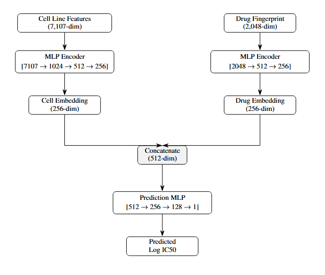

# Drug Response Prediction Project

## Project Overview

This project utilizes machine learning (ML) models to predict drug response (IC50 values) for cancer cell lines using:
- **Gene expression data** (2,369 genes)
- **Copy number variations** (CNV)
- **Mutation data** (hotspot mutations)
- **Drug molecular fingerprints** (Morgan fingerprints)

## Architecture


## Project Structure
```
drug-response-prediction/
│
├── data/
│   ├── raw/                              # Original data files
│   │   ├── CCLE_2369_EXP.csv          
│   │   ├── CCLE_2369_binary_cnv.csv    
│   │   ├── CCLE_2369_hotspot_mut.csv    
│   │   ├── drug_smiles.csv             
│   │   └── sorted_IC50_82833_580_170.csv 
│   │
│   ├── processed/                        # Preprocessed features and splits (.pkl)
│   │   ├── cell_features.pkl            
│   │   ├── drug_features.pkl          
│   │   ├── response_data.pkl         
│   │   └── splits_*.pkl                
│   │
│   ├── preprocessing.py                  # Data preprocessing pipeline
│   ├── dataset.py                        # PyTorch Dataset class
│   └── splits.py                         # Create 5-fold CV splits
│
├── models/
│   └── drp_model.py                      # Network architecture
│
├── utils/
│   └── metrics.py                        # Evaluation metrics (MSE, MAE, RMSE)
│
├── results/                              # Training results and metrics + graph visualization png
│   ├── random/
│   ├── cell_blind/
│   ├── drug_blind/
│   ├── cell_drug_blind/
│   └── comparison_bar_plot.png
│
├── checkpoints/                          # Saved model weights (gitignored)
│
├── train.py                              # Main training script
├── visualize_results.py                  # Generate plots and summary
├── requirements.txt                      # Python dependencies
├── modelarch.png                         # Image of the model architecture
└── README.md
```
##  Getting Started

### Prerequisites

- Python 3.9+
- CUDA-capable GPU (HIGHLY recommended)

### Environment Setup
```bash
# Create environment (PLEASE do this on ASU's SOL if possible)
module load cuda-11.8.0-gcc-12.1.0
module load mamba/latest
mamba create -n DRPproj python=3.9 pytorch torchvision torchaudio pytorch-cuda=11.8 -c pytorch -c nvidia
source activate DRPproj

# Verify that the environment works
python -c "import torch; print(torch.version.cuda, torch.cuda.is_available())"

# Install other dependencies
pip install -r requirements.txt
```

### Pipeline Phases
```bash
# 1. Preprocess data
python data/preprocessing.py

# 2. Create cross-validation splits
python data/splits.py

# 3. Train model (choose split type)
python train.py --split_type random

# 4. Generate visualizations (View raw results in "results/" directory)
python visualize_results.py
```

## Training Details

### Hyperparameters (see below to customize certain parameters in command line itself)
```python
{
    'batch_size': 256,
    'learning_rate': 1e-3,
    'weight_decay': 1e-5,
    'max_epochs': 100,
    'patience': 10,           
    'embed_dim': 256,
    'dropout': 0.3,
    'n_folds': 5
}
```

### Custom Training Parameters
```bash
# Adjust hyperparameters
python train.py --split_type cell_blind \
                --batch_size 128 \
                --lr 0.0005 \
                --epochs 50 \
                --patience 15
```

## Results Summary

| Split Type | MSE | MAE | RMSE | Improvement over Baseline |
|------------|-----|-----|------|---------------------------|
| **Random** | 0.86 ± 0.03 | 0.68 ± 0.01 | 0.93 ± 0.02 | **89.1%** |
| **Cell-Blind** | 1.72 ± 0.08 | 0.98 ± 0.02 | 1.31 ± 0.03 | **78.2%** |
| **Drug-Blind** | 5.49 ± 1.29 | 1.83 ± 0.22 | 2.33 ± 0.28 | **30.2%** |
| **Cell-Drug-Blind** | 6.01 ± 1.22 | 1.88 ± 0.19 | 2.44 ± 0.24 | **23.6%** |
| *Baseline (Mean)* | *7.87* |

**Key Finding:** The model demonstrates strong generalization to new cell lines (78% improvement) but faces challenges with new drugs (30% improvement), suggesting drug representation is the primary reason for lackluster performance in certain splits. This is undoubtedly an avenue to explore in the future and is more thoroughly addressed in the final report.


